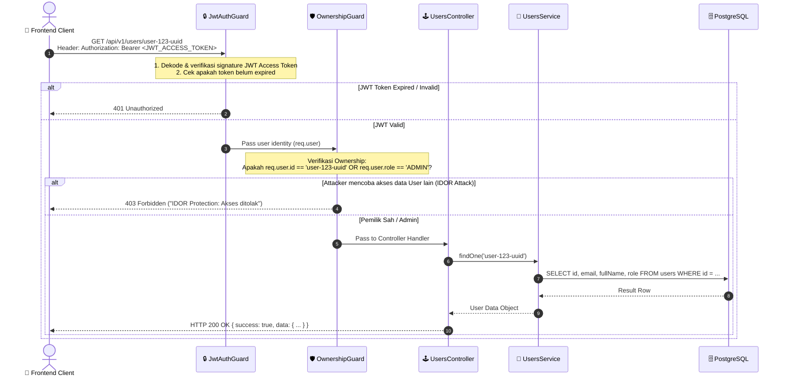

# 🔄 ALUR KERJA END-TO-END: aegisAPI (Database ➡️ NestJS ➡️ Frontend Client)

Dokumen ini menjelaskan alur data, arsitektur layer, serta mekanisme pengamanan **aegisAPI** secara mendalam dari level fisik **Database PostgreSQL** hingga dikonsumsi oleh aplikasi **Frontend** (React, Vue, Next.js, Flutter, dsb).

---

## 📋 DAFTAR ISI
1. [Arsitektur Layer Backend (Overview)](#1-arsitektur-layer-backend-overview)
2. [Diagram Alur (Sequence Diagram)](#2-diagram-alur-sequence-diagram)
   - [A. Alur Login & Autentikasi (Dual Token)](#a-alur-login--autentikasi-dual-token)
   - [B. Alur Request Terproteksi & IDOR Prevention](#b-alur-request-terproteksi--idor-prevention)
3. [Rincian Alur Langkah-demi-Langkah (Layer per Layer)](#3-rincian-alur-langkah-demi-langkah)
   - [Layer 1: Physical Database (PostgreSQL 16)](#layer-1-physical-database-postgresql-16)
   - [Layer 2: ORM & Data Mapping (Prisma Client)](#layer-2-orm--data-mapping-prisma-client)
   - [Layer 3: Core Service & Business Logic](#layer-3-core-service--business-logic)
   - [Layer 4: Security Pipeline & Middleware](#layer-4-security-pipeline--middleware)
   - [Layer 5: Controller & HTTP Endpoint](#layer-5-controller--http-endpoint)
   - [Layer 6: Network & HTTP Response](#layer-6-network--http-response)
   - [Layer 7: Frontend Consumption (Client Side)](#layer-7-frontend-consumption-client-side)
4. [Panduan Integrasi Frontend (Contoh Axios / Fetch)](#4-panduan-integrasi-frontend-contoh-axios--fetch)

---

## 1. ARSITEKTUR LAYER BACKEND (OVERVIEW)

Secara umum, data dan request mengalir melalui 7 layer berikut:

```text
┌────────────────────────────────────────────────────────────────────────┐
│ 🌐 FRONTEND CLIENT (React / Next.js / Mobile App)                     │
└───────────────────────────────────┬────────────────────────────────────┘
                                    │ HTTP Request (JSON Payload / Headers / Cookies)
                                    ▼
┌────────────────────────────────────────────────────────────────────────┐
│ 🛡️ LAYER SECURITY & MIDDLEWARE (NestJS Pipeline)                      │
│    • Helmet (Security Headers)                                         │
│    • Rate Limiter (ThrottlerGuard - Max 5 attempts/min on Auth)        │
│    • ValidationPipe (Sanitasi DTO & Whitelisting Mass-Assignment)     │
│    • JwtAuthGuard (Validasi Access Token Bearer)                       │
│    • RolesGuard (Validasi RBAC: USER vs ADMIN)                         │
│    • OwnershipGuard (Proteksi IDOR / BOLA)                             │
└───────────────────────────────────┬────────────────────────────────────┘
                                    │ Executed Handler
                                    ▼
┌────────────────────────────────────────────────────────────────────────┐
│ 🕹️ CONTROLLER LAYER (AuthController, UsersController)                  │
│    Menerima DTO valid, mengatur HTTP Status Code, & set HTTP-Only Cookie│
└───────────────────────────────────┬────────────────────────────────────┘
                                    │ Call Service Methods
                                    ▼
┌────────────────────────────────────────────────────────────────────────┐
│ 🧠 BUSINESS LOGIC & SERVICE LAYER (AuthService, UsersService)          │
│    Argon2 Hashing, Token Generation, Audit Logging                     │
└───────────────────────────────────┬────────────────────────────────────┘
                                    │ Type-Safe DB Query
                                    ▼
┌────────────────────────────────────────────────────────────────────────┐
│ 🔌 ORM LAYER (Prisma Client & PrismaService)                           │
│    Parameterized Query Generator (Anti SQL Injection)                  │
└───────────────────────────────────┬────────────────────────────────────┘
                                    │ SQL Protocol (TCP Port 5432)
                                    ▼
┌────────────────────────────────────────────────────────────────────────┐
│ 🗄️ PHYSICAL DATABASE (PostgreSQL 16 - aegis_api_db)                    │
│    Tabel: users, refresh_tokens, audit_logs                            │
└────────────────────────────────────────────────────────────────────────┘
```

---

## 2. DIAGRAM ALUR (SEQUENCE DIAGRAM)

### A. Alur Login & Autentikasi (Dual Token)

```mermaid
sequenceDiagram
    autonumber
    actor User as 👤 Frontend Client
    participant Pipe as 🛡️ ValidationPipe & Throttler
    participant Ctrl as 🕹️ AuthController
    participant Svc as 🧠 AuthService / Argon2
    participant DB as 🗄️ Prisma & PostgreSQL

    User->>Pipe: POST /api/v1/auth/login { email, password }
    Note over Pipe: 1. Cek Rate Limit (Max 5/min)<br/>2. Validasi format email & string password
    Pipe->>Ctrl: Payload Valid DTO
    Ctrl->>Svc: login(LoginDto, ipAddress, userAgent)
    Svc->>DB: findUnique({ where: { email } })
    DB-->>Svc: Data User + Hashed Password (Argon2)
    Svc->>Svc: Verify Argon2 Password Hash
    
    alt Password Salah / User Tidak Ada
        Svc->>DB: Save Audit Log (LOGIN_FAILED)
        Svc-->>User: 401 Unauthorized ("Email atau password salah")
    else Password Benar
        Svc->>Svc: Generate Access Token (15m) & Refresh Token (7d)
        Svc->>Svc: Hash Refresh Token dengan Argon2
        Svc->>DB: Save Hashed Refresh Token & Audit Log (LOGIN_SUCCESS)
        Svc-->>Ctrl: Return AccessToken & RefreshToken & UserProfile
        Ctrl-->>User: HTTP 200 OK<br/>• Body: { accessToken, user }<br/>• Header: Set-Cookie (refresh_token=...; HttpOnly; SameSite=Strict)
    end
```

---

### B. Alur Request Terproteksi & IDOR Prevention



---

## 3. RINCIAN ALUR LANGKAH-DEMI-LANGKAH

### Layer 1: Physical Database (PostgreSQL 16)
- **Fungsi:** Menyimpan data secara persisten dan ACID-compliant.
- **Komponen Utama:**
  - Database: `aegis_api_db` di `localhost:5432`.
  - Tabel `users`: Menyimpan kredensial akun, password terenkripsi Argon2id, role (`USER` / `ADMIN`), dan status `isActive`.
  - Tabel `refresh_tokens`: Menyimpan hash dari refresh token yang aktif untuk mendukung token revocation & rotation.
  - Tabel `audit_logs`: Mencatat jejak audit keamanan (`LOGIN_SUCCESS`, `ACCESS_DENIED`, `IP_ADDRESS`, `USER_AGENT`).

### Layer 2: ORM & Data Mapping (Prisma Client)
- **Fungsi:** Mengabstraksi query database ke dalam kode TypeScript yang *type-safe* dan otomatis mencegah **SQL Injection** melalui *Parameterized Queries*.
- **Alur Kerja:**
  1. `PrismaService` di-inject ke dalam Service Layer.
  2. Saat dipanggil, Prisma menyusun SQL Prepared Statement yang aman dan mengeksekusinya ke PostgreSQL melalui koneksi TCP port 5432.

### Layer 3: Core Service & Business Logic
- **Fungsi:** Tempat seluruh aturan bisnis (business logic) dan kriptografi dijalankan.
- **Komponen Utama:**
  - `Argon2Service`: Mengamankan password menggunakan memori-hard hashing algorithm (Argon2id: 64MB Memory, 3 Iterations).
  - `AuthService`: Mengatur proses autentikasi, pengecekan password, pembuatan dual token (Access Token 15 menit & Refresh Token 7 hari), dan token rotation.
  - `AuditLogService`: Mencatat aktivitas keamanan secara *asynchronous* ke tabel `audit_logs`.

### Layer 4: Security Pipeline & Middleware
- **Fungsi:** Menyaring setiap HTTP Request yang masuk sebelum menyentuh Controller (Defense in Depth).
- **Mekanisme Penyaringan:**
  1. **Helmet Middleware:** Menambahkan HTTP Security Headers (`X-Frame-Options`, `X-Content-Type-Options: nosniff`, `Strict-Transport-Security`).
  2. **ValidationPipe:** Menginspeksi payload request. Menolak properti asing yang tidak ada di DTO (`forbidNonWhitelisted: true`) untuk mencegah **Mass Assignment Attack**.
  3. **ThrottlerGuard (Rate Limiter):** Membatasi request (contoh: maksimal 5 kali percobaan login per menit per IP) untuk menangkal **Brute-Force / Credential Stuffing Attack**.
  4. **JwtAuthGuard:** Meng-extract JWT dari header `Authorization: Bearer <token>`, memverifikasi signature digital dengan `JWT_ACCESS_SECRET`.
  5. **RolesGuard (RBAC):** Memastikan peran pengguna (`req.user.role`) sesuai dengan annotation `@Roles()`.
  6. **OwnershipGuard (IDOR Defense):** Membandingkan ID resource di URL (`/users/:id`) dengan ID pengguna pada token JWT.

### Layer 5: Controller & HTTP Endpoint
- **Fungsi:** Menerima request yang telah lolos saringan keamanan, memanggil Service, dan mengembalikan HTTP Response.
- **Alur Pengiriman Response:**
  - Pada login/refresh sukses, controller menginjeksi Refresh Token ke dalam **HTTP-Only Cookie**:
    ```typescript
    res.cookie('refresh_token', refreshToken, {
      httpOnly: true, // Mencegah akses dari JavaScript (Anti-XSS Token Theft)
      secure: process.env.NODE_ENV === 'production',
      sameSite: 'strict', // Mencegah Cross-Site Request Forgery (CSRF)
      maxAge: 7 * 24 * 60 * 60 * 1000, // 7 Hari
    });
    ```
  - Access Token dan data profil pengguna dikembalikan dalam JSON Response Body.

### Layer 6: Network & HTTP Response
- **Fungsi:** Transmisi data dari server backend ke frontend via protokol HTTP/HTTPS.
- **Struktur Response Standar aegisAPI:**
  ```json
  {
    "success": true,
    "message": "Login berhasil.",
    "data": {
      "accessToken": "eyJhbGciOiJIUzI1NiIsInR5cCI6IkpXVCJ9...",
      "user": {
        "id": "c39a8e41-0b5c-4f81-807e-123456789abc",
        "email": "user@example.com",
        "fullName": "Budi Santoso",
        "role": "USER"
      }
    }
  }
  ```

### Layer 7: Frontend Consumption (Client Side)
- **Fungsi:** Aplikasi klien (React, Next.js, Vue, Flutter, iOS/Android) yang berinteraksi dengan pengguna.
- **Aturan Pengelolaan Token di Frontend:**
  1. **Access Token:** Disimpan dalam **Memory (State App / Redux / Zustand / React Context)**. *JANGAN pernah menyimpan Access Token di `localStorage` karena rentan terhadap pencurian via XSS Attack.*
  2. **Refresh Token:** Disimpan otomatis oleh browser di **HTTP-Only Cookie**. Frontend JavaScript tidak perlu dan tidak bisa membaca cookie ini secara manual.
  3. **Automatic Credentials:** Setiap request HTTP dari frontend wajib menyertakan opsi `{ withCredentials: true }` (Axios) atau `credentials: 'include'` (Fetch API) agar browser mengirimkan cookie `refresh_token` saat memanggil endpoint `/auth/refresh`.

---

## 4. PANDUAN INTEGRASI FRONTEND (CONTOH AXIOS / FETCH)

Berikut adalah contoh implementasi standar di Frontend untuk mengonsumsi aegisAPI secara aman:

### A. Setup Axios Instance (`apiClient.ts`)

```typescript
import axios from 'axios';

// 1. Buat Axios instance dengan baseURL & credentials support
export const api = axios.create({
  baseURL: 'http://localhost:3000/api/v1',
  withCredentials: true, // WAJIB agar HTTP-Only cookie terkirim
});

// Variable internal untuk menyimpan Access Token di memory (Bukan localStorage!)
let memoryAccessToken: string | null = null;

export const setAccessToken = (token: string | null) => {
  memoryAccessToken = token;
};

// 2. Request Interceptor: Otomatis tempelkan Access Token di Authorization Header
api.interceptors.request.use((config) => {
  if (memoryAccessToken) {
    config.headers.Authorization = `Bearer ${memoryAccessToken}`;
  }
  return config;
});

// 3. Response Interceptor: Otomatis Refresh Token jika dapat 401 Unauthorized
api.interceptors.response.use(
  (response) => response,
  async (error) => {
    const originalRequest = error.config;

    // Jika error 401 dan belum pernah retry refresh token
    if (error.response?.status === 401 && !originalRequest._retry) {
      originalRequest._retry = true;

      try {
        // Panggil endpoint refresh token (Cookie refresh_token terkirim otomatis oleh browser)
        const refreshResponse = await axios.post(
          'http://localhost:3000/api/v1/auth/refresh',
          {},
          { withCredentials: true }
        );

        const newAccessToken = refreshResponse.data.data.accessToken;
        setAccessToken(newAccessToken);

        // Ulangi request awal dengan Access Token baru
        originalRequest.headers.Authorization = `Bearer ${newAccessToken}`;
        return api(originalRequest);
      } catch (refreshError) {
        // Jika Refresh Token juga expired/invalid, logout user & redirect ke halaman Login
        setAccessToken(null);
        window.location.href = '/login';
        return Promise.reject(refreshError);
      }
    }

    return Promise.reject(error);
  }
);
```

### B. Contoh Komponen Login & Fetch Data

```typescript
// 1. Fungsi Login
async function handleLogin(email: string, password: string) {
  try {
    const res = await api.post('/auth/login', { email, password });
    
    // Simpan Access Token di memory
    setAccessToken(res.data.data.accessToken);
    console.log('Login Sukses, User:', res.data.data.user);
  } catch (error: any) {
    console.error('Login Gagal:', error.response?.data?.message);
  }
}

// 2. Mengambil Profil User yang Sedang Login
async function getUserProfile() {
  try {
    const res = await api.get('/users/me');
    console.log('Profil User:', res.data.data);
  } catch (error: any) {
    console.error('Gagal mengambil profil:', error.response?.data?.message);
  }
}
```

---

## 🎯 KESIMPULAN

Arsitektur **aegisAPI** menjamin keamanan data dari level terluar hingga terdalam:
1. **Keamanan Transmisi & Token:** Dual Token dengan `HttpOnly`, `SameSite=Strict` Cookie melindungi frontend dari serangan XSS & CSRF.
2. **Keamanan Akses Data:** `OwnershipGuard` mencegah IDOR/BOLA, sedangkan `RolesGuard` menegakkan RBAC.
3. **Keamanan Data Persisten:** Password di-hash menggunakan Argon2id di database PostgreSQL 16, dan Prisma ORM menangkal SQL Injection.
